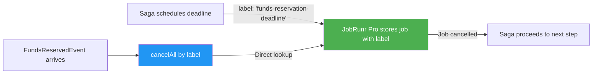
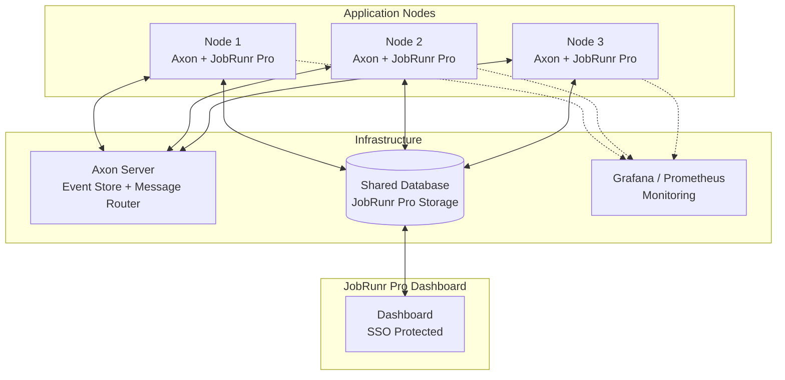

If you're building financial software in Java, chances are you've encountered two hard problems: keeping a reliable audit trail of every state change, and coordinating long-running business processes that span multiple services. 

The first problem is often solved by **Event Sourcing**. The second mostly by the **Saga pattern**. And the framework most banks reach for to implement both? **Axon Framework**.

But there's a third problem that often gets overlooked until it causes real damage: **what happens when nothing happens?** 

When a payment confirmation never arrives. When a KYC verification times out. When a trade settlement deadline passes silently. That's where **deadline management** comes in, and it's exactly where **JobRunr Pro** has become the go-to solution for Axon Framework users in production.

In this post, we'll walk through why this combination is so powerful, and why [AxonIQ chose to replace Quartz Scheduler with JobRunr]() inside their framework.

### Tldr; Why JobRunr Pro + Axon Framework?

| Challenge | What Axon Provides | What JobRunr Pro Adds |
| :--- | :--- | :--- |
| **Audit Trail** | Event Sourcing — every state change stored as an immutable event | — |
| **Complex Transactions** | Saga pattern — orchestrating multi-step business flows | — |
| **Deadline Management** | `DeadlineManager` interface — scheduling timeouts in sagas | `JobRunrProDeadlineManager` — distributed, searchable, cancellable deadlines |
| **Observability** | Axon Server dashboard | Real-time job dashboard, Micrometer metrics, SSO |
| **Cancellation** | `cancelAll` / `cancelAllWithinScope` API | Job search by label — An only implementation that makes `cancelAll` efficient |

_Table: How Axon Framework and JobRunr Pro complement each other_

## Why Banks Choose Event Sourcing

Traditional CRUD systems store only the current state. When a regulator asks "what was the state of this account at 3:47 PM on March 12th?", you're stuck. 

Event sourcing flips this model: instead of storing the current state, you store **every event that led to it**. The current state is just a projection, a view computed from the event stream.

For financial institutions, this is a regulatory requirement.

| Regulation | What It Requires | How Event Sourcing Helps |
| :--- | :--- | :--- |
| **PSD2** | Full traceability of payment transactions | Every payment state change is an immutable event |
| **MiFID II** | Complete audit trail, record-keeping for 5+ years | Event store is the complete, append-only history |
| **Basel III / BCBS 239** | Produce complete risk data within hours, auditable calculations | Event replay reconstructs any historical state on demand |
| **SOX** | Internal controls and audit trails for financial reporting | Events are tied to user ID; separation of duties enforced via command handlers |
| **PCI-DSS** | Tracking access to cardholder data, 1-year retention minimum | Events capture who did what, when — retention managed by event store config |
| **DORA** | ICT incident reporting, operational resilience testing | Workflow history provides incident evidence; replay enables testing |

_Table: Regulatory drivers for event sourcing in financial services_

This is exactly why **Nets**, a major European payment processor, built their platform on Axon Framework. As they put it: event sourcing produces an _"out-of-the-box audit trail essential for compliance and regulatory purposes in financial services."_ 

It's why a **Global Bank** built its Keystone Customer Lifecycle Management system, handling KYC, AML, and due diligence, on Axon with a 5-node cluster in Kubernetes. 

And it's why **Rabobank** processes billions of domain events daily on Axon Server Enterprise.

## The Saga Pattern: Coordinating Financial Transactions

In a monolithic banking application, a payment transfer is a single database transaction. In a microservices world, that same transfer touches multiple services like accounts, fraud detection, compliance, and notifications. 

You can't use a distributed transaction across all of them. Instead, you use the **Saga pattern**.

A Saga breaks a complex business transaction into a sequence of local transactions. Each step publishes an event that triggers the next. If a step fails, the saga executes **compensating actions** to undo what was already done.


<!--  -->

Here's what this looks like in Axon Framework:

```java
@Saga
public class PaymentTransferSaga {

    @Autowired
    private transient CommandGateway commandGateway;
    @Autowired
    private transient DeadlineManager deadlineManager;

    private String transferId;

    @StartSaga
    @SagaEventHandler(associationProperty = "transferId")
    public void on(TransferInitiatedEvent event) {
        this.transferId = event.getTransferId();

        // Step 1: Reserve the funds
        commandGateway.send(new ReserveFundsCommand(event.getSourceAccount(), event.getAmount()));

        // Schedule a deadline: if funds aren't reserved within 30 seconds, compensate
        deadlineManager.schedule(
            Duration.ofSeconds(30), "funds-reservation-deadline"
        );
    }

    @SagaEventHandler(associationProperty = "transferId")
    public void on(FundsReservedEvent event) {
        // Funds reserved — cancel the deadline and proceed
        deadlineManager.cancelAll("funds-reservation-deadline");

        // Step 2: Screen for fraud
        commandGateway.send(new ScreenTransactionCommand(transferId));

        // New deadline for fraud screening
        deadlineManager.schedule(
            Duration.ofSeconds(60), "fraud-screening-deadline"
        );
    }

    @DeadlineHandler(deadlineName = "funds-reservation-deadline")
    public void onFundsReservationTimeout() {
        // Deadline expired — the service didn't respond in time
        commandGateway.send(new CancelTransferCommand(transferId, "Funds reservation timed out"));
        SagaLifecycle.end();
    }
}
```

>**Notice the pattern**: Schedule a deadline, wait for the expected event, cancel the deadline when it arrives, or take compensating action when it expires. 
><br/><br/>
>
>This is the heartbeat of every financial saga.

When a deadline is missed because the scheduler was too slow, a cancellation didn't go through, or a misfire wasn't handled, the consequences are concrete: stuck funds, duplicate compensations, regulatory fines, or customers who can't access their money. 

In a system processing thousands of transfers per minute, those `deadlineManager.schedule()` and `deadlineManager.cancelAll()` calls happen constantly.

Which brings us to the critical question: **what's running those deadlines under the hood?**

## The Deadline Manager Problem

Axon Framework defines the `DeadlineManager` as an interface. The actual scheduling work is delegated to an implementation. Historically, there have been four options:

| Implementation | Distributed | Job Search | `cancelAll` Performance | Monitoring | Maintenance Status |
| :--- | :--- | :--- | :--- | :--- | :--- |
| `SimpleDeadlineManager` | No | N/A | N/A | None | Active |
| `QuartzDeadlineManager` | Yes | No | Scans all jobs | None built-in | Sporadic (last stable: 2019) |
| `DbSchedulerDeadlineManager` | Yes | No | Serializes & loops all tasks | Micrometer only | Active |
| **`JobRunrProDeadlineManager`** | **Yes** | **Yes (by label)** | **Direct lookup** | **Dashboard + Micrometer + SSO** | **Active** |

_Table: Comparing Axon Framework deadline manager implementations_

### Why Quartz Falls Short

For years, Quartz was the default. But in production financial systems, its limitations become painful:

- **11 database tables** just for the scheduler : Often more than the application's own schema
- **No job search capability** :  You can't look up deadlines by type, saga, or label
- **`cancelAll` is expensive** : Without search, cancelling all deadlines of a given type requires scanning the entire job store
- **No built-in monitoring** : no dashboard, no Micrometer integration, no way to see what's happening
- **Sporadic maintenance** : the last stable release was in 2019. The `javax` to `jakarta` migration is still a pain point
- **Verbose, dated API** : [configuring Quartz for Axon](https://zambrovski.medium.com/configuring-quartz-deadlines-in-axon-framework-c26677caf8a0) requires significant boilerplate

But perhaps the most damning issue is raw performance. Quartz maintains a separate lock table and requires multiple database round-trips per job:

```sql
-- Quartz: 5 queries per job
SELECT * FROM QRTZ_LOCKS WHERE ...;       -- Check lock
INSERT INTO QRTZ_LOCKS ...;                -- Acquire lock
SELECT * FROM QRTZ_TRIGGERS WHERE ...;     -- Get job
UPDATE QRTZ_TRIGGERS SET ...;              -- Update status
DELETE FROM QRTZ_LOCKS ...;                -- Release lock
```

JobRunr uses a single atomic operation with modern SQL:

```sql
-- JobRunr: 1 query per job
SELECT ... FROM jobs WHERE status='SCHEDULED' FOR UPDATE SKIP LOCKED LIMIT 1;
```

The result? In a [benchmark of 500,000 jobs on PostgreSQL](), **JobRunr Pro processed jobs 18x faster than Quartz** (2,732 jobs/sec vs. 145 jobs/sec). 

For deadline-heavy financial workloads with thousands of concurrent sagas, that difference is the gap between a system that keeps up and one that doesn't.

### The db-scheduler Trade-off

db-scheduler is simpler (just one table), but it has a critical limitation for deadline management: **it cannot filter jobs**. The [Axon documentation](https://docs.axoniq.io/axon-framework-reference/4.11/deadlines/deadline-managers/) states this clearly:

> _"Db-scheduler has no way to filter out tasks. This means that the `cancelAll` implementation will need to serialize all the task data, looping over it. If you have many active deadlines, this might take noticeable time and resources."_


## Why JobRunr Pro Is the Solution

This is precisely why AxonIQ built the [JobRunr Pro extension](https://github.com/AxonFramework/extension-jobrunrpro). The key capability that makes it all work: **JobRunr Pro can search and filter jobs by status and label**.

When Axon's `JobRunrProDeadlineManager` schedules a deadline, it attaches a label. When the saga needs to cancel that deadline (because the expected event arrived), it doesn't scan the entire job store. It performs a **direct, indexed lookup by label** and cancels exactly the right jobs.

<!-- TODO: Create image from the Mermaid diagram below and save as /blog/axon-deadline-cancel-flow.webp
-->




<!--  -->

### What You Get Out of the Box

Setting up the `JobRunrProDeadlineManager` in a Spring Boot application is straightforward. Add the dependency:



```xml
<dependency>
    <groupId>org.axonframework.extensions.jobrunrpro</groupId>
    <artifactId>axon-jobrunrpro-spring-boot-starter</artifactId>
    <version>${axon-jobrunrpro.version}</version>
</dependency>
```


```groovy
implementation 'org.axonframework.extensions.jobrunrpro:axon-jobrunrpro-spring-boot-starter:${axon-jobrunrpro.version}'
```



Spring Boot auto-configuration does the rest. If you already have a `JobScheduler` bean (from the `jobrunr-spring-boot-3-starter` or `jobrunr-spring-boot-4-starter`), the extension picks it up and creates the `JobRunrProDeadlineManager` automatically. No Quartz tables. No XML configuration. No boilerplate.

Not using Spring Boot? The extension works just as well with plain Java using the builder pattern:

```java
DeadlineManager deadlineManager = JobRunrProDeadlineManager.proBuilder()
        .jobScheduler(jobScheduler)
        .storageProvider(storageProvider)
        .scopeAwareProvider(scopeAwareProvider)
        .serializer(serializer)
        .transactionManager(transactionManager)
        .spanFactory(spanFactory)
        .build();
```

See the [full Axon extension documentation](https://docs.axoniq.io/jobrunr-pro-extension-reference/4.11/) for all configuration options.

And because it's JobRunr Pro, you also get:

- **A real-time dashboard**: see every scheduled deadline, its status, and its label. Filter by saga type, deadline name, or status.
- **Micrometer integration**:  export deadline metrics to Prometheus, Grafana, or any monitoring tool
- **SSO via OpenID**: restrict dashboard access to authorized personnel (a must for financial environments)
- **Distributed processing**: deadlines are processed across all your application nodes automatically

<!-- TODO: Create image from the Mermaid diagram below and save as /blog/axon-jobrunr-architecture.webp
-->




<!--  -->

## A Real-World Example: Payment Transfer with Deadline Management

Let's put it all together with a complete payment transfer saga that uses `JobRunrProDeadlineManager` for every critical timeout:

```java
@Saga
public class PaymentTransferSaga {

    @Autowired
    private transient CommandGateway commandGateway;
    @Autowired
    private transient DeadlineManager deadlineManager;

    private String transferId;
    private BigDecimal amount;
    private String sourceAccount;

    @StartSaga
    @SagaEventHandler(associationProperty = "transferId")
    public void on(TransferInitiatedEvent event) {
        this.transferId = event.getTransferId();
        this.amount = event.getAmount();
        this.sourceAccount = event.getSourceAccount();

        commandGateway.send(new ReserveFundsCommand(sourceAccount, amount));
        deadlineManager.schedule(Duration.ofSeconds(30), "funds-reservation-deadline");
    }

    @SagaEventHandler(associationProperty = "transferId")
    public void on(FundsReservedEvent event) {
        deadlineManager.cancelAll("funds-reservation-deadline");
        commandGateway.send(new ScreenTransactionCommand(transferId, amount));
        deadlineManager.schedule(Duration.ofMinutes(2), "fraud-check-deadline");
    }

    @SagaEventHandler(associationProperty = "transferId")
    public void on(FraudCheckPassedEvent event) {
        deadlineManager.cancelAll("fraud-check-deadline");
        commandGateway.send(new ExecuteTransferCommand(transferId));
        deadlineManager.schedule(Duration.ofMinutes(5), "settlement-deadline");
    }

    @SagaEventHandler(associationProperty = "transferId")
    public void on(TransferCompletedEvent event) {
        deadlineManager.cancelAll("settlement-deadline");
        SagaLifecycle.end();
    }

    // --- Deadline handlers: compensating actions ---

    @DeadlineHandler(deadlineName = "funds-reservation-deadline")
    public void onFundsTimeout() {
        commandGateway.send(new FailTransferCommand(transferId, "Funds reservation timed out"));
        SagaLifecycle.end();
    }

    @DeadlineHandler(deadlineName = "fraud-check-deadline")
    public void onFraudCheckTimeout() {
        commandGateway.send(new ReleaseFundsCommand(sourceAccount, amount));
        commandGateway.send(new FailTransferCommand(transferId, "Fraud check timed out"));
        SagaLifecycle.end();
    }

    @DeadlineHandler(deadlineName = "settlement-deadline")
    public void onSettlementTimeout() {
        commandGateway.send(new ReleaseFundsCommand(sourceAccount, amount));
        commandGateway.send(new FailTransferCommand(transferId, "Settlement timed out"));
        SagaLifecycle.end();
    }
}
```

In this single saga, there are **three deadlines** scheduled and potentially cancelled. In a system processing 1,000 transfers per minute, that's up to **3,000 deadline schedules and 3,000 deadline cancellations per minute**. 

With Quartz or db-scheduler, each `cancelAll` would scan the entire job store. With JobRunr Pro, each cancellation is a direct label-based lookup.

## Key Takeaways

If you're building event-driven financial systems with Axon Framework, the choice of deadline manager has real consequences:

| Scenario | Without JobRunr Pro | With JobRunr Pro |
| :--- | :--- | :--- |
| **Cancelling a deadline** | Full table scan or serialization loop | Direct label-based lookup |
| **Monitoring deadline health** | Custom tooling or log parsing | Built-in dashboard with filters |
| **Debugging a stuck saga** | Query the database manually | Search by deadline name in the dashboard |
| **Meeting audit requirements** | No visibility into scheduler state | Full job lifecycle history |
| **Scaling to multiple nodes** | Complex Quartz clustering config | Works out of the box |

_Table: The practical impact of choosing JobRunr Pro as your deadline manager_

For banks, fintechs, and any organization building on Axon Framework with the Saga pattern, JobRunr Pro is the infrastructure that helps make your deadlines reliable, observable, and fast.


## Getting Started

- **Axon Framework + JobRunr Pro extension**: [GitHub repository](https://github.com/AxonFramework/extension-jobrunrpro)
- **Extension documentation**: [Axon docs](https://docs.axoniq.io/jobrunr-pro-extension-reference/4.11/)
- **JobRunr Pro**: [Documentation]() | [Start a free trial]()
- **Already using Quartz?** See our guide on [moving from Quartz to JobRunr]()
