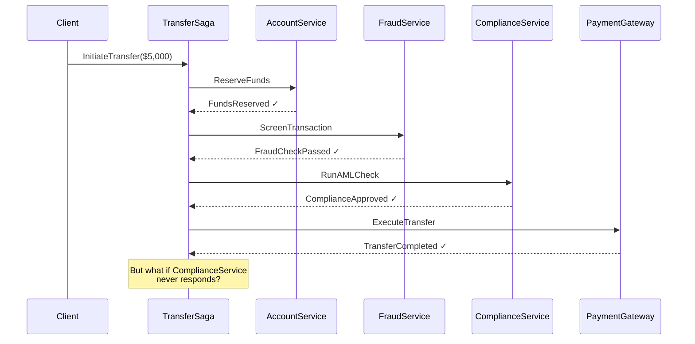
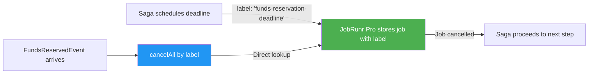
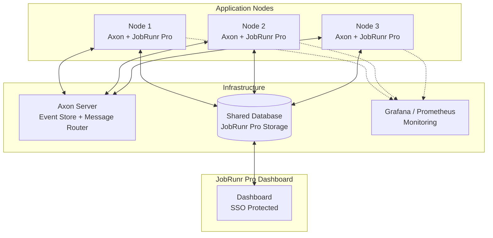

> [!TIP]
> Would you rather watch a YouTube video where we explain how Axon and JobRunr Pro work together and walk you through a working code example? [Check the video on YouTube here](https://youtu.be/RQrIeYic__0).

If you're building financial software in Java, chances are you've encountered two hard problems: keeping a reliable audit trail of every state change, and coordinating long-running business processes that span multiple services. 

The first problem is often solved by **Event Sourcing**. The second mostly by the **Saga pattern**. And the framework most banks reach for to implement both? **Axon Framework**.

But there's a third problem that often gets overlooked until it causes real damage: **what happens when nothing happens?** 

When a payment confirmation never arrives. When a KYC verification times out. When a trade settlement deadline passes silently. That's where **deadline management** comes in, and it's exactly where **JobRunr Pro** has become the go-to solution for Axon Framework users in production.

In this post, we'll walk through why this combination is so powerful, and why [AxonIQ chose to replace Quartz Scheduler with JobRunr]() inside their framework.

### Tldr; Why JobRunr Pro + Axon Framework?

| Challenge | What Axon Provides | What JobRunr Pro Adds |
| :--- | :--- | :--- |
| **Audit Trail** | Event Sourcing — every state change stored as an immutable event | — |
| **Complex Transactions** | Saga pattern — orchestrating multi-step business flows | — |
| **Deadline Management** | `DeadlineManager` interface — scheduling timeouts in sagas | `JobRunrProDeadlineManager` — distributed, searchable, cancellable deadlines |
| **Observability** | Axon Server dashboard | Real-time job dashboard, Micrometer metrics, SSO |
| **Cancellation** | `cancelAll` / `cancelAllWithinScope` API | Job search by label — An only implementation that makes `cancelAll` efficient |

_Table: How Axon Framework and JobRunr Pro complement each other_

## What is Axon Framework?

[Axon Framework](https://docs.axoniq.io/) is a Java framework for building event-driven applications based on CQRS (Command Query Responsibility Segregation) and Event Sourcing. It provides the building blocks that make these patterns practical rather than theoretical: **aggregates** that enforce business rules and emit events, a **command bus** for dispatching operations, an **event store** that persists every state change as an immutable event, and **sagas** that coordinate long-running business processes across multiple services.

Built and maintained by [AxonIQ](https://www.axoniq.io/), the framework is widely adopted in financial services, insurance, and government — industries where audit trails, traceability, and transactional integrity aren't optional. Optionally paired with **Axon Server** for distributed message routing and event storage, it scales from a single Spring Boot application to multi-node clusters processing billions of events.

The key abstractions we'll focus on in this post are **event-sourced aggregates**, the **Saga pattern**, and the **`DeadlineManager` interface** — the extension point where JobRunr Pro plugs in.

## Why Banks Choose Event Sourcing

Traditional CRUD systems store only the current state. When a regulator asks "what was the state of this account at 3:47 PM on March 12th?", you're stuck. 

Event sourcing flips this model: instead of storing the current state, you store **every event that led to it**. The current state is just a projection, a view computed from the event stream.

For financial institutions, this is a regulatory requirement.

| Regulation | What It Requires | How Event Sourcing Helps |
| :--- | :--- | :--- |
| **PSD2** | Full traceability of payment transactions | Every payment state change is an immutable event |
| **MiFID II** | Complete audit trail, record-keeping for 5+ years | Event store is the complete, append-only history |
| **Basel III / BCBS 239** | Produce complete risk data within hours, auditable calculations | Event replay reconstructs any historical state on demand |
| **SOX** | Internal controls and audit trails for financial reporting | Events are tied to user ID; separation of duties enforced via command handlers |
| **PCI-DSS** | Tracking access to cardholder data, 1-year retention minimum | Events capture who did what, when — retention managed by event store config |
| **DORA** | ICT incident reporting, operational resilience testing | Workflow history provides incident evidence; replay enables testing |

_Table: Regulatory drivers for event sourcing in financial services_

This is exactly why **[Nets](https://www.axoniq.io/use-cases/nets-payments)**, a major European payment processor, built their platform on Axon Framework. As they put it: event sourcing produces an _"out-of-the-box audit trail essential for compliance and regulatory purposes in financial services."_

It's why a **[Global Bank](https://www.axoniq.io/hubfs/collateral/cb-gb-2022-01.pdf)** built its Keystone Customer Lifecycle Management system, handling KYC, AML, and due diligence, on Axon with a 5-node cluster in Kubernetes.

And it's why **[The world's top banks](https://www.axoniq.io/blog/why-top-banks-choose-axoniq)** process billions of domain events daily on Axon Server Enterprise.

## The Saga Pattern: Coordinating Financial Transactions

In a monolithic banking application, a payment transfer is a single database transaction. In a microservices world, that same transfer touches multiple services like accounts, fraud detection, compliance, and notifications. 

You can't use a distributed transaction across all of them. Instead, you use the **Saga pattern**.

A Saga breaks a complex business transaction into a sequence of local transactions. Each step publishes an event that triggers the next. If a step fails, the saga executes **compensating actions** to undo what was already done.




<!--  -->

Here's what this looks like in Axon Framework:

```java
@Saga
@JsonAutoDetect(fieldVisibility = JsonAutoDetect.Visibility.ANY)
public class PaymentTransferSaga {

    @Autowired
    private transient CommandGateway commandGateway;
    @Autowired
    private transient DeadlineManager deadlineManager;

    private String transferId;

    @StartSaga
    @SagaEventHandler(associationProperty = "transferId")
    public void on(TransferInitiatedEvent event) {
        this.transferId = event.transferId();

        // Step 1: Reserve the funds
        commandGateway.send(new ReserveFundsCommand(event.sourceAccount(), event.amount()));

        // Schedule a deadline: if funds aren't reserved within 30 seconds, compensate
        deadlineManager.schedule(
            Duration.ofSeconds(30), "funds-reservation-deadline"
        );
    }

    @SagaEventHandler(associationProperty = "transferId")
    public void on(FundsReservedEvent event) {
        // Funds reserved — cancel the deadline and proceed
        deadlineManager.cancelAll("funds-reservation-deadline");

        // Step 2: Screen for fraud
        commandGateway.send(new ScreenTransactionCommand(transferId));

        // New deadline for fraud screening
        deadlineManager.schedule(
            Duration.ofSeconds(60), "fraud-screening-deadline"
        );
    }

    @DeadlineHandler(deadlineName = "funds-reservation-deadline")
    public void onFundsReservationTimeout() {
        // Deadline expired — the service didn't respond in time
        commandGateway.send(new CancelTransferCommand(transferId, "Funds reservation timed out"));
        SagaLifecycle.end();
    }
}
```

>**Notice the pattern**: Schedule a deadline, wait for the expected event, cancel the deadline when it arrives, or take compensating action when it expires.
><br/><br/>
>
>This is the heartbeat of every financial saga.

An important detail: commands and events flow through Axon's own command bus and event store — they're dispatched and processed immediately. JobRunr Pro is _only_ involved when `deadlineManager.schedule()` is called. The deadline is the safety net that fires if the expected event never arrives, and that's the part that needs to be reliable, distributed, and observable.

Two things worth noting in the code above. The `commandGateway` and `deadlineManager` fields are marked `transient` — they're Spring-injected dependencies that shouldn't be serialized when Axon persists the saga state. And the `@JsonAutoDetect` annotation ensures Jackson can serialize the saga's private fields (like `transferId`) between steps. Without it, those fields will be `null` when the next event handler runs — a subtle bug that's easy to miss.

When a deadline is missed because the scheduler was too slow, a cancellation didn't go through, or a misfire wasn't handled, the consequences are concrete: stuck funds, duplicate compensations, regulatory fines, or customers who can't access their money. 

In a system processing thousands of transfers per minute, those `deadlineManager.schedule()` and `deadlineManager.cancelAll()` calls happen constantly.

Which brings us to the critical question: **what's running those deadlines under the hood?**

## The Deadline Manager Problem

Axon Framework defines the `DeadlineManager` as an interface. The actual scheduling work is delegated to an implementation. Historically, there have been four options:

| Implementation | Distributed | Job Search | `cancelAll` Performance | Monitoring | Maintenance Status |
| :--- | :--- | :--- | :--- | :--- | :--- |
| `SimpleDeadlineManager` | No (in-memory) | N/A | N/A | None | Active |
| `QuartzDeadlineManager` | Yes | No | Scans all jobs | None built-in | Sporadic |
| `DbSchedulerDeadlineManager` | Yes | No | Serializes & loops all tasks | Micrometer only | Active |
| **`JobRunrProDeadlineManager`** | **Yes** | **Yes (by label)** | **Direct lookup** | **Dashboard + Micrometer + SSO** | **Active** |

_Table: Comparing Axon Framework deadline manager implementations_

The `SimpleDeadlineManager` keeps everything in memory on a single node — fine for local development and testing, but deadlines are lost on restart. For production, you need a distributed implementation, and that's where the trade-offs between Quartz, db-scheduler, and JobRunr Pro become important.

## Why JobRunr Pro Is the Solution

This is precisely why AxonIQ built the [JobRunr Pro extension](https://github.com/AxonFramework/extension-jobrunrpro). The key capability that makes it all work: **JobRunr Pro can search and filter jobs by status and label**.

When Axon's `JobRunrProDeadlineManager` schedules a deadline, it attaches a label. When the saga needs to cancel that deadline (because the expected event arrived), it doesn't scan the entire job store. It performs a **direct lookup by label** and cancels exactly the right jobs.

Axon's `DeadlineManager` API offers two cancellation methods: `cancelAll("deadline-name")` cancels all deadlines with that name across every saga instance, while `cancelAllWithinScope("deadline-name")` only cancels deadlines scoped to the current saga instance. In a system with thousands of concurrent transfer sagas, that distinction matters — and both are efficient with JobRunr Pro because they resolve to label-based lookups.




<!--  -->

### What You Get Out of the Box

Setting up the `JobRunrProDeadlineManager` in a Spring Boot application is straightforward. Add the dependency:



```xml
<dependency>
    <groupId>org.axonframework.extensions.jobrunrpro</groupId>
    <artifactId>axon-jobrunrpro-spring-boot-starter</artifactId>
    <version>${axon-jobrunrpro.version}</version>
</dependency>
```


```groovy
implementation 'org.axonframework.extensions.jobrunrpro:axon-jobrunrpro-spring-boot-starter:${axon-jobrunrpro.version}'
```



You'll also need the JobRunr Pro Spring Boot starter itself, which provides the `JobScheduler` bean that the extension depends on:



```xml
<dependency>
    <groupId>org.jobrunr</groupId>
    <artifactId>jobrunr-pro-spring-boot-3-starter</artifactId>
    <version>${jobrunr-pro.version}</version>
</dependency>
```


```groovy
implementation 'org.jobrunr:jobrunr-pro-spring-boot-3-starter:${jobrunr-pro.version}'
```



With both dependencies in place, Spring Boot auto-configuration does the rest. The extension picks up the `JobScheduler` bean and creates the `JobRunrProDeadlineManager` automatically. No Quartz tables. No XML configuration. No boilerplate.

Not using Spring Boot? The extension works just as well with plain Java using the builder pattern:

```java
DeadlineManager deadlineManager = JobRunrProDeadlineManager.proBuilder()
        .jobScheduler(jobScheduler)
        .storageProvider(storageProvider)
        .scopeAwareProvider(scopeAwareProvider)
        .serializer(serializer)
        .transactionManager(transactionManager)
        .spanFactory(spanFactory)
        .build();
```

See the [full Axon extension documentation](https://docs.axoniq.io/jobrunr-pro-extension-reference/4.11/) for all configuration options.

And because it's JobRunr Pro, you also get:

- **A real-time dashboard**: see every scheduled deadline, its status, and its label. Filter by saga type, deadline name, or status.
- **Micrometer integration**:  export deadline metrics to Prometheus, Grafana, or any monitoring tool
- **SSO via OpenID**: restrict dashboard access to authorized personnel (a must for financial environments)
- **Distributed processing**: deadlines are processed across all your application nodes automatically




<!--  -->

### Why Quartz Falls Short

For years, Quartz was the default. But in production financial systems, its limitations become painful:

- **11 database tables** just for the scheduler: That's a lot of schema overhead for a component that isn't your core business logic
- **No job search capability**: You can't look up deadlines by type, saga, or label. The [Axon documentation](https://docs.axoniq.io/axon-framework-reference/4.11/deadlines/deadline-managers/) notes that the `QuartzDeadlineManager` doesn't support searching scheduled deadlines.
- **`cancelAll` is expensive**: Without search, cancelling all deadlines of a given type requires scanning the entire job store
- **No built-in monitoring**: no dashboard, no Micrometer integration, no way to see what's happening
- **Sporadic maintenance**: Quartz went years without a stable release before 2.5.0 landed in late 2023, and the pace of updates remains slow
- **Verbose, dated API**: [configuring Quartz for Axon](https://zambrovski.medium.com/configuring-quartz-deadlines-in-axon-framework-c26677caf8a0) requires significant boilerplate

But perhaps the most damning issue is raw performance. Quartz maintains a separate lock table and requires multiple database round-trips per job:

```sql
-- Quartz: 5 queries per job
SELECT * FROM QRTZ_LOCKS WHERE ...;       -- Check lock
INSERT INTO QRTZ_LOCKS ...;                -- Acquire lock
SELECT * FROM QRTZ_TRIGGERS WHERE ...;     -- Get job
UPDATE QRTZ_TRIGGERS SET ...;              -- Update status
DELETE FROM QRTZ_LOCKS ...;                -- Release lock
```

JobRunr uses a single atomic operation with modern SQL:

```sql
-- JobRunr: 1 query per job
SELECT ... FROM jobs WHERE status='SCHEDULED' FOR UPDATE SKIP LOCKED LIMIT 1;
```

The `SKIP LOCKED` clause is key: it lets concurrent workers each grab a different job without blocking each other, eliminating the need for a separate lock table entirely. One query does the work of five.

The result? In a [benchmark of 500,000 jobs on PostgreSQL](), **JobRunr Pro processed jobs 18x faster than Quartz** (2,732 jobs/sec vs. 145 jobs/sec).

For deadline-heavy financial workloads with thousands of concurrent sagas, that difference is the gap between a system that keeps up and one that doesn't.

### The db-scheduler Trade-off

db-scheduler is simpler (just one table), but it has a critical limitation for deadline management: **it cannot filter jobs**. The [Axon documentation](https://docs.axoniq.io/axon-framework-reference/4.11/deadlines/deadline-managers/) states this clearly:

> _"Db-scheduler has no way to filter out tasks. This means that the `cancelAll` implementation will need to serialize all the task data, looping over it. If you have many active deadlines, this might take noticeable time and resources."_


## A Real-World Example: Payment Transfer with Deadline Management

Let's put it all together with a complete payment transfer saga that uses `JobRunrProDeadlineManager` for every critical timeout:

```java
@Saga
@JsonAutoDetect(fieldVisibility = JsonAutoDetect.Visibility.ANY)
public class PaymentTransferSaga {

    @Autowired
    private transient CommandGateway commandGateway;
    @Autowired
    private transient DeadlineManager deadlineManager;

    private String transferId;
    private BigDecimal amount;
    private String sourceAccount;

    @StartSaga
    @SagaEventHandler(associationProperty = "transferId")
    public void on(TransferInitiatedEvent event) {
        this.transferId = event.transferId();
        this.amount = event.amount();
        this.sourceAccount = event.sourceAccount();

        commandGateway.send(new ReserveFundsCommand(sourceAccount, amount));
        deadlineManager.schedule(Duration.ofSeconds(30), "funds-reservation-deadline");
    }

    @SagaEventHandler(associationProperty = "transferId")
    public void on(FundsReservedEvent event) {
        deadlineManager.cancelAll("funds-reservation-deadline");
        commandGateway.send(new ScreenTransactionCommand(transferId, amount));
        deadlineManager.schedule(Duration.ofMinutes(2), "fraud-check-deadline");
    }

    @SagaEventHandler(associationProperty = "transferId")
    public void on(FraudCheckPassedEvent event) {
        deadlineManager.cancelAll("fraud-check-deadline");
        commandGateway.send(new ExecuteTransferCommand(transferId));
        deadlineManager.schedule(Duration.ofMinutes(5), "settlement-deadline");
    }

    @SagaEventHandler(associationProperty = "transferId")
    public void on(TransferCompletedEvent event) {
        deadlineManager.cancelAll("settlement-deadline");
        SagaLifecycle.end();
    }

    // --- Deadline handlers: compensating actions ---
    // When a deadline fires, the expected event never arrived.
    // These handlers undo what was already done and fail the transfer gracefully.

    @DeadlineHandler(deadlineName = "funds-reservation-deadline")
    public void onFundsTimeout() {
        commandGateway.send(new FailTransferCommand(transferId, "Funds reservation timed out"));
        SagaLifecycle.end();
    }

    @DeadlineHandler(deadlineName = "fraud-check-deadline")
    public void onFraudCheckTimeout() {
        // Compensating action: release the reserved funds back to the source
        commandGateway.send(new ReleaseFundsCommand(sourceAccount, amount));
        commandGateway.send(new FailTransferCommand(transferId, "Fraud check timed out"));
        SagaLifecycle.end();
    }

    @DeadlineHandler(deadlineName = "settlement-deadline")
    public void onSettlementTimeout() {
        // Compensating action: release the reserved funds back to the source
        commandGateway.send(new ReleaseFundsCommand(sourceAccount, amount));
        commandGateway.send(new FailTransferCommand(transferId, "Settlement timed out"));
        SagaLifecycle.end();
    }
}
```

In this single saga, there are **three deadlines** scheduled and potentially cancelled. In a system processing 1,000 transfers per minute, that's up to **3,000 deadline schedules and 3,000 deadline cancellations per minute**. 

With Quartz or db-scheduler, each `cancelAll` would scan the entire job store. With JobRunr Pro, each cancellation is a direct label-based lookup.

## Key Takeaways

If you're building event-driven financial systems with Axon Framework, the choice of deadline manager has real consequences:

| Scenario | Without JobRunr Pro | With JobRunr Pro |
| :--- | :--- | :--- |
| **Cancelling a deadline** | Full table scan or serialization loop | Direct label-based lookup |
| **Monitoring deadline health** | Custom tooling or log parsing | Built-in dashboard with filters |
| **Debugging a stuck saga** | Query the database manually | Search by deadline name in the dashboard |
| **Meeting audit requirements** | No visibility into scheduler state | Full job lifecycle history |
| **Scaling to multiple nodes** | Complex Quartz clustering config | Works out of the box |

_Table: The practical impact of choosing JobRunr Pro as your deadline manager_

For banks, fintechs, and any organization building on Axon Framework with the Saga pattern, JobRunr Pro is the infrastructure that helps make your deadlines reliable, observable, and fast.

## Beyond Deadlines: How Financial Institutions Use JobRunr Pro

Saga deadline management is what brings many Axon Framework users to JobRunr Pro, but once it's in their stack, teams quickly adopt it for the rest of their background processing. 

Financial institutions like JPMorgan Chase, Raiffeisen Bank, and One Savings Bank run JobRunr Pro in production for workloads far beyond sagas:

- **Generating monthly credit card statements and account reports**: millions of PDFs on a schedule, with [Priority Queues]() ensuring urgent regulatory reports skip the line
- **End-of-day batch processing**: interest calculations, reconciliation runs, and settlement summaries migrated from mainframes using [Atomic Batches]() that preserve transactional safety
- **Fraud screening and KYC notifications**: short-running, latency-sensitive tasks that benefit from SmartQueue for significantly faster throughput
- **Urgent corporate payment processing**: companies like Veefin Solutions use priority queues so critical transfers never wait behind lower-priority batch work
- **Multi-tenant workload isolation**: Banks use [Dynamic Queues]() to ensure one heavy client never degrades performance for others
- **Cross-datacenter monitoring**: distributed teams at insurance and banking companies use the [Multi-Cluster Dashboard]() with [SSO]() for a single-pane-of-glass view across all environments

For a full overview of how financial institutions use JobRunr Pro, see our [Finance Solutions page](/en/finance/).

## Getting Started

 **Runnable demo project**: [Axon + JobRunr Pro demo](https://www.jobrunr.io/en/pro/) — a complete payment transfer saga with deadline management you can clone and run locally 
- **Axon Framework + JobRunr Pro extension**: [GitHub repository](https://github.com/AxonFramework/extension-jobrunrpro)
- **Extension documentation**: [Axon docs](https://docs.axoniq.io/jobrunr-pro-extension-reference/4.11/)
- **JobRunr Pro**: [Documentation]() | [Start a free trial]()
- **Already using Quartz?** See our guide on [moving from Quartz to JobRunr]()
