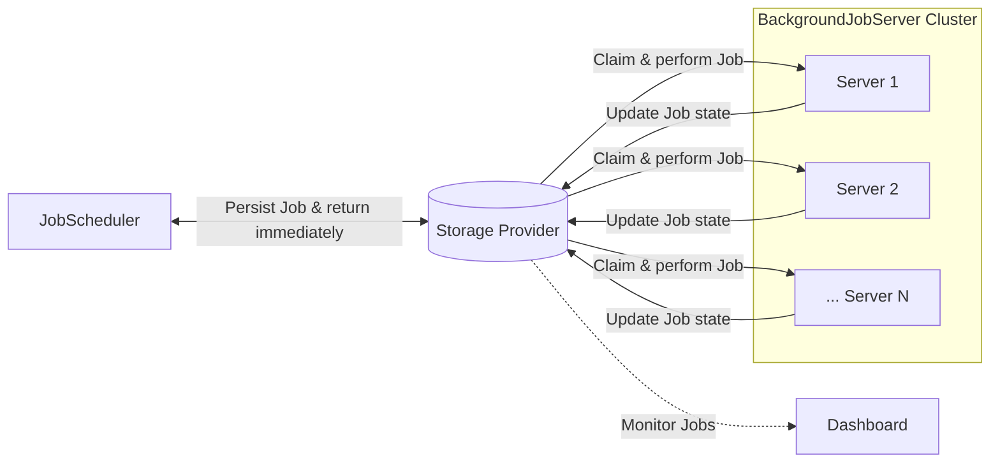

<div class="block sm:hidden mb-4">

> Visiting via your mobile phone? The JobRunr website is more extensive on desktop.
</div>

<div class="p-4 bg-black rounded-lg text-white mb-6">
  <strong class="text-white">JobRunr DocsGPT is here to help</strong><br>
  Trained on all our documentation, it's your fastest way to get unstuck.<br>
  <a onclick="chatbase.open()" class="cursor-pointer text-white underline">Open the chatbot now →</a>
</div>

## What is JobRunr?

JobRunr is an easy way to perform fire-and-forget, delayed and recurring asynchronous tasks on the JVM, using only Java 8 lambdas, with distributed execution across multiple instances. Jobs are persisted in your existing database so nothing gets lost across restarts or failures. Automatic retries handle the unexpected, while a built-in dashboard gives you real-time visibility into every job.

```java
BackgroundJob.enqueue(() -> emailService.sendWelcomeEmail(userId));
```

That one line is a durable, distributed background job. JobRunr serializes the lambda to JSON, stores it in your existing database, and returns to the caller immediately — a `BackgroundJobServer` picks it up and executes it, whether on the same JVM or across a cluster.

## Why JobRunr?

**Developer-friendly API:** Simple and flexible, designed to fit any software architecture with minimal dependencies and few changes to your existing codebase.

**Persistent storage:** JobRunr stores jobs in the same SQL or NoSQL database your application already uses (PostgreSQL, MySQL, MongoDB, and more). No extra infrastructure to operate.

**Fault-tolerant:** Every job is retried automatically up to 10 times with exponential back-off if it fails. JobRunr handles transient failures (e.g., network blips, downstream outages, application restarts) so you don't have to.

**Built-in observability:** Thanks to the built-in dashboard, it's easy to monitor your jobs in real time: inspect any job, see why it failed, requeue or delete it.

**No separate deployment:** JobRunr is a library, not a service. There is no separate deployment required, it starts when your application starts.

**Distributed processing:** Scale out by running more instances of your application, each one automatically joins the processing cluster and picks up jobs, with guaranteed single execution.

## How JobRunr works



1. Your code calls `BackgroundJob.enqueue()` (or `schedule()`, or `scheduleRecurrently()`).
2. The [JobScheduler]() inspects the lambda using ASM, serializes the type, method, and arguments to JSON, and writes a `Job` record to the [StorageProvider](). Control returns to the caller right after this.
3. One or more [BackgroundJobServers]() poll the StorageProvider for new enqueued jobs and process them. Additionally, the longest running server is automatically elected as master, it handles housekeeping (enqueue scheduled jobs, schedule recurring jobs, delete jobs, etc.).
4. On success the job is marked `SUCCEEDED`. On failure the [RetryFilter]() reschedules it with exponential back-off.
5. A Dashboard allows to follow to monitor your job scheduling system.

## Where to go next

- **Learning the basics of JobRunr?** Keep on reading this page. 
- **Just getting started?** Follow the [5-minute intro]() or the [quickstart guide](/en/guides/intro/5-minute-quickstart/).
- **Adding JobRunr to your project?** See [Installation]() and pick a [StorageProvider]().
- **Integrating with your framework?** Choose your setup: [Spring Boot](), [Micronaut](), [Quarkus](), or the [Fluent API]().
- **Need enterprise features?** [JobRunr Pro]() adds batches, job chaining (aka workflows), priority queues, rate limiting, SSO, and more.



---

## Core concepts

### Scheduling Jobs & Recurring Jobs

At the core of JobRunr, we have the `Job` entity - it contains the name, the signature, the `JobDetails` (the type, the method to execute and all arguments) and the history - including all states - of the background job itself. A `Job` is a unit of work that should be performed outside of the current execution context, e.g. in a background thread, other process, or even on different server – all is possible with JobRunr, without any additional configuration.

A `RecurringJob` is in essence a `Job` with a `cron` expression or a fixed interval attached. The master node checks for due recurring jobs on each poll cycle and and schedules them. More technically, a `RecurringJob` creates multiple `Jobs` during its lifetime.

#### Creating jobs

You may create jobs in two ways, either using a `JobLambda` or using a `JobRequest`.

**Via a Java 8 lambda** — pass a lambda referencing the method to execute. JobRunr uses ASM to inspect it and extract the type, method name, and arguments.

```java
BackgroundJob.enqueue(() -> emailService.sendWelcomeEmail(userEmail));
```

`BackgroundJob` is a convenience class with static helper methods; it delegates to the `JobScheduler` under the hood. You can also inject and use `JobScheduler` directly, which is preferable for testability.

Delayed and recurring jobs follow the same pattern:

```java
// Run once, 5 days from now
BackgroundJob.schedule(Instant.now().plus(5, DAYS), () -> emailService.sendFollowUp(userEmail));

// Run every day
BackgroundJob.scheduleRecurrently("daily-report", Cron.daily(), () -> reportService.sendDailyReport());
```

When using Spring, Micronaut, or Quarkus, you can also declare recurring jobs declaratively with the `@Recurring` annotation — JobRunr will register them automatically on startup.

The lambda approach is the least invasive option — no new classes to create. It works with both Java and Kotlin lambdas.

**Via a `JobRequest`** — implement the `JobRequest` interface to carry the job's data, and pair it with a `JobRequestHandler` that performs the work. This follows the command/handler pattern and is a good fit when you want a clear separation between job data and job logic.

```java
// The request carries the data
public class SendEmailRequest implements JobRequest {
    private final String userId;
    // ...
    @Override
    public Class<SendEmailRequestHandler> getJobRequestHandler() {
        return SendEmailRequestHandler.class;
    }
}

// The handler performs the work
public class SendEmailRequestHandler implements JobRequestHandler<SendEmailRequest> {
    @Override
    public void run(SendEmailRequest request) {
        // do the work
    }
}
```

To create a `Job` using this pattern you have to use `BackgroundJobRequest` or `JobRequestScheduler`. For instance, registering the above `JobRequest` can be done as follows:

```java
BackgroundJobRequest.enqueue(new SendEmailRequest(userId));
```

`BackgroundJobRequest` and `JobRequestScheduler` offer the same APIs as `BackgroundJob` and `JobScheduler`.

#### Configuring jobs

Two mechanisms let you provide additional information to a `Job`: its name, number of retries, labels, and more.

**`@Job` annotation** — place it on the method being executed.

```java
@Job(name = "Send welcome email", retries = 3)
public void sendWelcomeEmail(String userEmail) { ... }
```

> [!TIP]
> `@Job` supports parameter substitution using `%0`, `%1`, etc. to reference method arguments by position — e.g. `"Send welcome email to %0"` resolves to `"Send welcome email to email@example.com"` at runtime.

**`JobBuilder`** — use it when you need greater flexibility, e.g., a computed job name. It wraps either a lambda or a `JobRequest`.

```java
BackgroundJob.create(JobBuilder.aJob()
    .withName("Send welcome email to " + userEmail)
    .withAmountOfRetries(3)
    .withDetails(() -> emailService.sendWelcomeEmail(userEmail)));
```

### Persisting Jobs with a StorageProvider

A `StorageProvider` is a place where JobRunr keeps all the information related to background job processing. All the details like types, method names, arguments, etc. are serialized to JSON and placed into storage, no data is kept in a process' memory. The `StorageProvider` is abstracted in JobRunr well enough to be implemented for [both RDBMS and NoSQL](()) solutions.

JobRunr supports Jackson, Gson, JSON-B, and Kotlin Serialization. See [Serialization]() for setup instructions.

> [!IMPORTANT]
> This is the main decision you must make, and the only configuration required before you start using the framework.

### Processing Jobs with a BackgroundJobServer

The `BackgroundJobServer` runs inside your application process and is responsible for executing jobs. It polls the `StorageProvider` for work, claims jobs atomically so the same job is never processed twice, and invokes the target method. Because all state lives in the storage provider, jobs are never lost — even if a server is terminated mid-processing, another server will pick up and retry the job after restart.

Run more instances of your application to scale out — each one starts a `BackgroundJobServer` and automatically joins the cluster. One server is elected **master**: it handles recurring job scheduling and housekeeping tasks. The rest act as workers.

> [!IMPORTANT]
> By default, the `BackgroundJobServer` is disabled. You need to explicitly enable it.

> [!CAUTION]
> Never start more than one `BackgroundJobServer` within the same JVM instance.

#### Accessing your application IoC container

When executing a job, JobRunr needs to resolve an instance of the class that holds the job method. By default it instantiates the class directly, but most applications use an [IoC container](https://en.wikipedia.org/wiki/Inversion_of_control) like Spring, Micronaut, or Quarkus. The `JobActivator` interface lets you plug in your container: given a class, it returns a fully initialized instance. When using a framework integration, JobRunr configures this automatically.

#### Handling failures

When a job fails, the built-in `RetryFilter` automatically reschedules it with exponential back-off — 10 attempts by default. After all retries are exhausted the job moves to `FAILED`, where it stays visible in the dashboard until you act on it. It is never silently dropped.

You can customize retry behaviour with the `@Job` annotation or a `JobBuilder`, or implement your own `RetryFilter` or custom `RetryPolicy` in JobRunr Pro.

#### Extending JobRunr with JobFilters

JobRunr exposes `JobFilter` hooks at every stage of the job lifecycle: before and after job creation (`JobClientFilter`), before and after processing (`JobServerFilter`), and on state transitions (`ElectStateFilter`, `ApplyStateFilter`). This lets you add custom logic — auditing, notifications, ... — without touching your job methods.

### Monitoring Jobs via the Dashboard

The `JobRunrDashboardWebServer` is a built-in web UI available at `http://localhost:8000` by default. It gives you a real-time view of all jobs and servers — monitor job states, inspect failures with full stack traces, requeue or delete jobs, and keep an eye on your processing cluster.

> [!IMPORTANT]
> By default, the dashboard is disabled. You need to explicitly enable it.

> [!PRO]
> Need advanced search, authentication, a custom context path, or embedding within your framework's server? See [JobRunr Pro Dashboard]().
